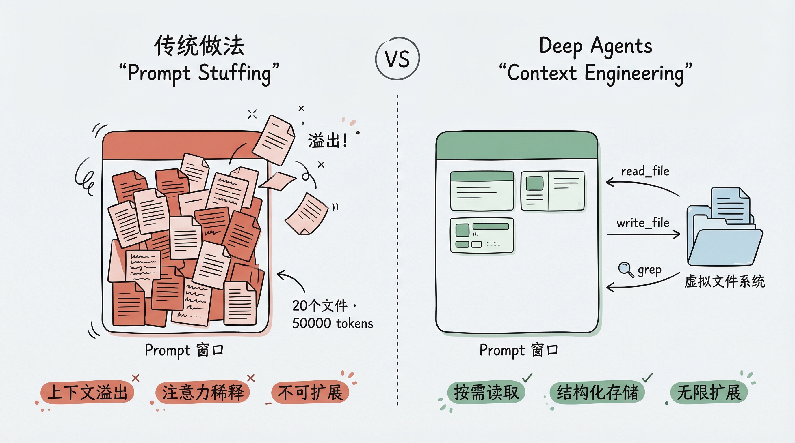
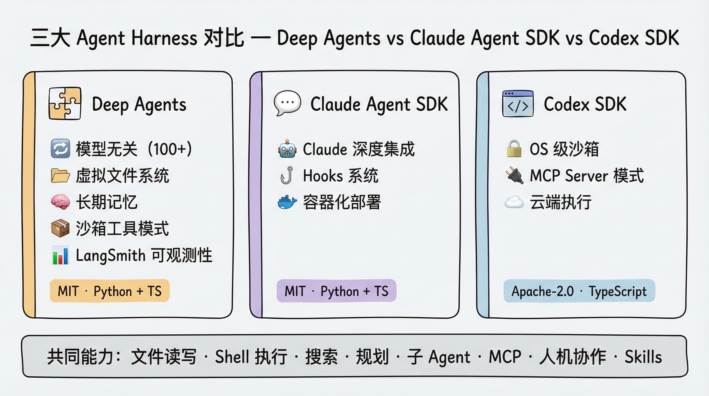

# 第 1 章：从 Agent Framework 到 Agent Harness — Deep Agents 的诞生逻辑

> 本章是《Deep Agents 实战》系列的开篇。我们不急着写代码，而是先回答一个根本问题：在 Agent 开发领域已经有那么多框架的今天，Deep Agents 为什么还要存在？它解决了什么问题？

## 一个真实的困境

假设你要构建一个 AI 编程助手。它需要：

- 读取项目中的源代码文件
- 理解代码结构，制定修改计划
- 分步骤执行修改，并追踪进度
- 处理过程中发现新问题时，能把子任务“委派”给专门的 Agent
- 在多轮对话中记住用户的偏好

如果你从零开始用 LangChain 搭建，你会发现自己在重复造轮子：手写文件读写工具、手写任务追踪逻辑、手写子 Agent 的调度机制……而这些能力，几乎每一个"认真"的 Agent 应用都需要。

这就是 Deep Agents 要解决的问题。

## Agent 开发的三个层次

在 LangChain 的技术栈中，Agent 开发被划分为三个层次。理解这三个层次，是理解 Deep Agents 定位的关键。

### 底层：Agent Runtime（运行时层）— LangGraph

**Agent Runtime** 是整个技术栈的基座，它解决的是"Agent 怎么可靠地运行"的问题：

- **持久化执行（Durable Execution）**：Agent 运行到一半崩溃了，能从断点恢复
- **流式输出（Streaming）**：让用户实时看到 Agent 的思考和操作过程
- **人机协作（Human-in-the-Loop）**：在关键操作前暂停，等待人工审批
- **状态管理（Persistence）**：跨对话保存上下文

LangGraph 就是这个底层运行时。它提供了一个基于图（Graph）的执行引擎，支持上面所有这些生产级特性。你可以把它理解为 Agent 世界的"操作系统"——所有上层应用都运行在它之上。

同一层的其他选手包括：Temporal、Inngest 等持久化执行引擎。

### 中间层：Agent Framework（框架层）— LangChain

**Agent Framework** 构建在 Runtime 之上，提供更高层次的开发体验：模型抽象、工具接口、Agent 循环、中间件（Middleware）等。

LangChain 就是这样一个框架。**LangChain 1.0 构建在 LangGraph 之上**——它利用 LangGraph 的图执行引擎和状态管理能力，但对外提供了更简洁的 API。你在使用 LangChain 时，通常不需要直接接触 LangGraph 的底层 API：

```python
from langchain import create_agent

agent = create_agent(
    model="gpt-4.1",
    tools=[web_search, calculator],
    system_prompt="You are a helpful assistant."
)
```

框架层的价值在于**标准化**和**易上手**。你不需要关心底层的执行引擎、状态持久化逻辑，框架帮你处理好了。

同一层的其他选手包括：Vercel 的 AI SDK、CrewAI、OpenAI Agents SDK、Google ADK、LlamaIndex 等。

### 上层：Agent Harness（工具层）— Deep Agents

这是最上面的一层，也是本系列课程的主角。

**Agent Harness** 是一个"开箱即用"的 Agent 套件，它在 Runtime 和 Framework 的基础上，**预置了一整套经过验证的工具和能力**。

这个概念怎么理解？打个比方：

- **Runtime** 给你提供了工作台、电源、安全护具（底层基础设施）
- **Framework** 给你提供了锤子、锯子、钉子（标准化开发工具）
- **Harness** 直接给你一个装好了的工具间，常用工具挂在墙上，工作流程贴在白板上（开箱即用）

Deep Agents 就是这样一个 Harness。它利用 LangChain 的核心构建块（模型、工具接口），运行在 LangGraph 的运行时之上，并预置了：

| 能力 | 说明 |
|---|---|
| 虚拟文件系统 | `read_file`、`write_file`、`edit_file`、`ls`、`glob`、`grep` 六大文件操作工具 |
| 任务规划 | `write_todos` 工具，让 Agent 能把复杂任务拆解为可追踪的步骤 |
| 子 Agent 委派 | `task` 工具，让 Agent 能将子任务派发给专门的 Agent |
| 长期记忆 | 基于 LangGraph Memory Store，支持跨对话的持久化记忆 |

同一层的其他选手包括：Anthropic 的 Claude Agent SDK、Manus 等。

### 三层关系一览

用一张表来总结（从底层到上层）：

| 层次 | 代表 | 核心价值 | 适用场景 |
|---|---|---|---|
| Runtime（底层） | LangGraph | 持久化执行、流式输出、人机协作、状态管理 | 需要精细控制的长期运行 Agent 和复杂工作流 |
| Framework（中间层） | LangChain | 模型抽象、工具接口、Agent 循环、中间件 | 快速上手、构建标准化的 Agent 应用 |
| Harness（上层） | Deep Agents | 预置工具、提示词、子 Agent、长期记忆 | 复杂多步骤任务、自主性较高的 Agent |

三者不是互相替代的关系，而是自底向上层层构建。LangGraph 是底层运行时，LangChain 构建在 LangGraph 之上提供更高层抽象，Deep Agents 则在两者之上提供开箱即用的 Agent 能力。你可以根据需求选择在不同层次上工作——需要最大灵活性就直接用 LangGraph，需要快速开发就用 LangChain，需要解决复杂任务就用 Deep Agents。


## 为什么需要 Agent Harness？

你可能会问：运行时和框架已经提供了构建 Agent 所需的一切，为什么还需要一个 Harness？

答案来自一个观察：**成功的 Agent 产品都长得差不多**。

看看市面上那些真正能完成复杂任务的 Agent 产品——Claude Code、Manus、Cursor——它们虽然各有特色，但核心能力惊人地相似：

1. **都有文件系统操作能力**：能读写、搜索、编辑文件
2. **都有任务规划能力**：能把大任务拆成小步骤
3. **都有子任务委派能力**：能把部分工作交给子 Agent
4. **都有上下文管理策略**：防止对话过长导致 LLM "失忆"

这些共性不是巧合。当 Agent 面对的任务足够复杂时，这些能力就是必需的。而 Agent Harness 的价值就在于：**把这些被验证过的模式固化下来，让你不需要每次都从头实现**。

## Deep Agents 的核心设计理念：Context Engineering

Deep Agents 的技术核心可以用一个概念概括：**Context Engineering**（上下文工程）。

### 传统做法的问题

传统的 Agent 开发中，所有信息都塞在 prompt 里：

```
System: 你是一个编程助手。
User: 请帮我重构 src/ 下的代码。
[附带: 20 个文件的完整内容，共 50000 tokens]
```

这种做法有几个致命问题：

- **上下文窗口溢出**：LLM 有 token 上限，文件一多就装不下
- **注意力稀释**：信息越多，LLM 对关键信息的关注度越低
- **不可扩展**：无法处理任意规模的项目

### Deep Agents 的做法

Deep Agents 的解决方案是引入一个**虚拟文件系统**，让 Agent 像人类一样工作：

- 需要读文件时，调用 `read_file` 按需读取
- 需要记录中间结果时，调用 `write_file` 写到文件里
- 需要搜索时，调用 `grep` 或 `glob` 查找
- 大文件只读取需要的部分（`offset` / `limit` 参数）

这样，Agent 的上下文里只保留当前步骤真正需要的信息，其余的都存在文件系统中，需要时再取。

更巧妙的是，这个"文件系统"是**虚拟的、可插拔的**：

- 可以是内存中的临时存储（开发调试用）
- 可以是本地磁盘（处理真实文件）
- 可以是持久化数据库（跨会话保持记忆）
- 可以是远程沙箱（安全执行代码）
- 甚至可以混合使用（不同路径路由到不同后端）

这就是 Context Engineering——**不是把所有信息都喂给 LLM，而是为 LLM 构建一个高效获取和管理信息的基础设施**。



## Deep Agents vs 竞品对比

市场上有三个主要的 Agent Harness：Deep Agents、Claude Agent SDK、Codex SDK。我们来看看它们的异同。

### 定位差异

| 维度 | Deep Agents | Claude Agent SDK | Codex SDK |
|---|---|---|---|
| **用途** | 通用 Agent（含编程） | 自定义 AI 编程 Agent | 预构建的编程 Agent |
| **模型支持** | 模型无关（Anthropic、OpenAI、Google、开源等 100+） | 绑定 Claude 系列 | 绑定 OpenAI 系列 |
| **SDK 语言** | Python + TypeScript | Python + TypeScript | TypeScript |
| **执行环境** | 本地 + 远程沙箱 + 虚拟文件系统 | 本地 | 本地 + 云端 |
| **开源协议** | MIT | MIT（底层 Claude Code 专有） | Apache-2.0 |

### 核心能力对比

三者在核心工具层面非常接近——文件读写、Shell 执行、搜索、规划、子 Agent、MCP、人机协作、Skills——都有覆盖。

真正的差异在架构层面：

**Deep Agents 的独有优势：**

- **模型灵活性**：随时切换模型提供商，不锁定任何厂商。这对企业级应用至关重要
- **长期记忆（Long-term Memory）**：通过 Memory Store 实现跨会话、跨线程的持久化记忆。Claude Agent SDK 和 Codex SDK 都不支持这一特性
- **虚拟文件系统 + 可插拔后端**：将文件操作抽象为统一接口，后端可以是内存、磁盘、数据库或沙箱
- **Sandbox-as-Tool 模式**：Agent 在本地运行，但可以把特定操作（如代码执行）发送到远程沙箱中执行。这是 Deep Agents 独有的设计
- **生产部署**：通过 LangGraph Platform 部署，配合 LangSmith 实现完整的可观测性

**Claude Agent SDK 的独有优势：**

- 与 Claude 模型的深度集成
- Hooks 系统，便于拦截和控制 Agent 行为
- 支持自定义 HTTP/WebSocket 层和容器化部署

**Codex SDK 的独有优势：**

- OS 级别的沙箱模式（`read-only`、`workspace-write`、`danger-full-access`）
- 内置 MCP Server 模式
- 云端执行环境



### 如何选择？

- **如果你需要模型灵活性和跨会话记忆** → Deep Agents
- **如果你的团队全面使用 Claude** → Claude Agent SDK
- **如果你的团队全面使用 OpenAI** → Codex SDK
- **如果你需要完整的生产部署和可观测性方案** → Deep Agents + LangSmith

## Deep Agents 的技术全景

最后，我们用一张图来总结 Deep Agents 在整个 LangChain 生态中的位置：


## 小结

本章我们理解了 Deep Agents 的设计定位：

1. **Agent 开发分为三个层次**：Runtime（LangGraph）→ Framework（LangChain）→ Harness（Deep Agents），自底向上层层构建
2. **Agent Harness 的价值**在于将成功 Agent 产品的共性能力（文件系统、任务规划、子 Agent、长期记忆）固化为开箱即用的组件
3. **Context Engineering** 是 Deep Agents 的核心理念——用虚拟文件系统按需管理上下文，而不是把所有信息塞进 prompt
4. **与竞品相比**，Deep Agents 的最大优势是模型无关性、虚拟文件系统的可插拔后端、长期记忆、以及完整的生产部署方案

下一章，我们将动手实践，用 5 分钟构建第一个 Deep Agent。
